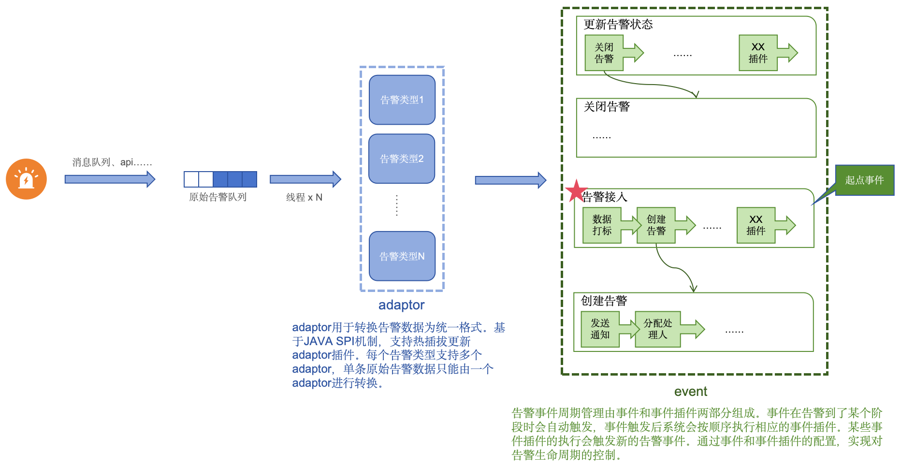
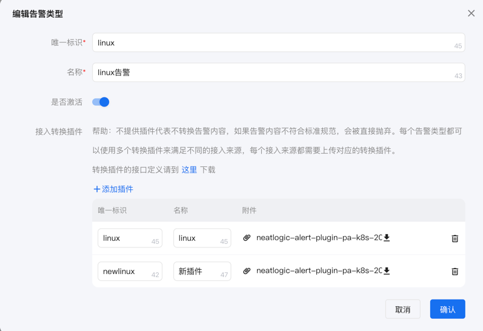
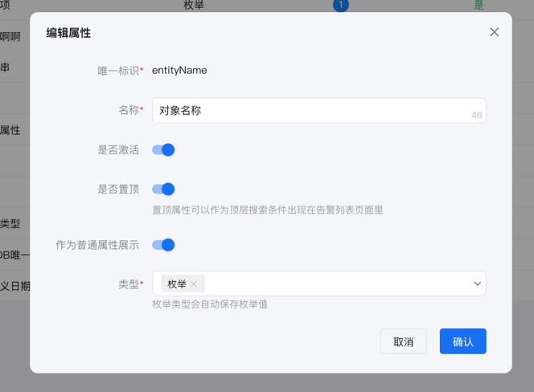
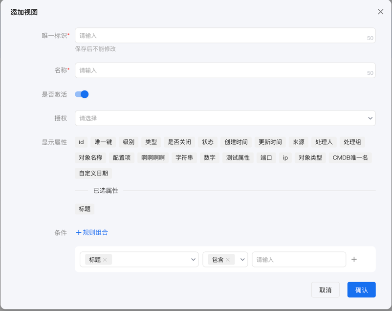
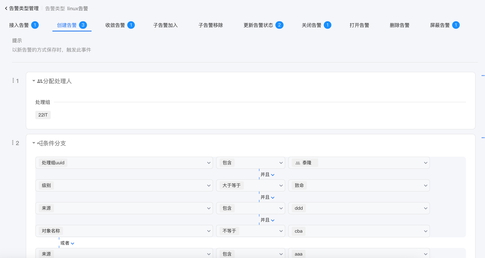
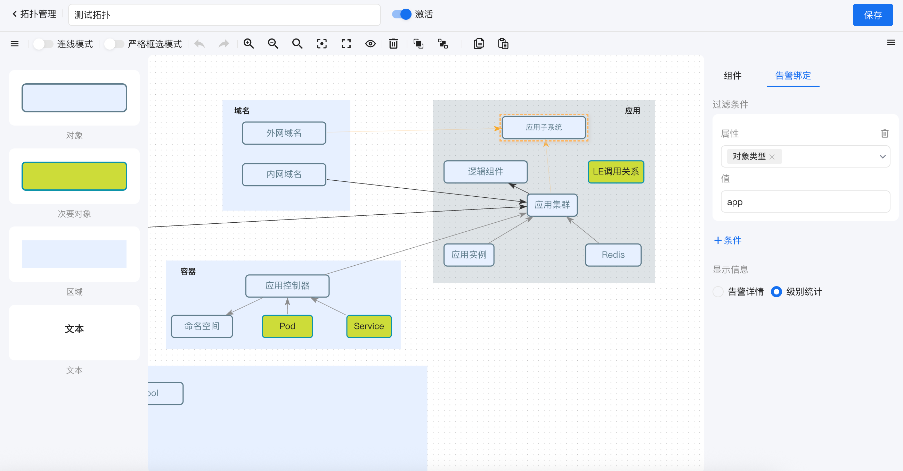
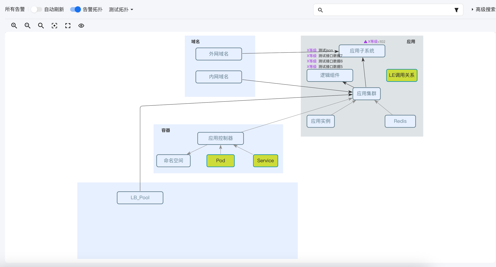
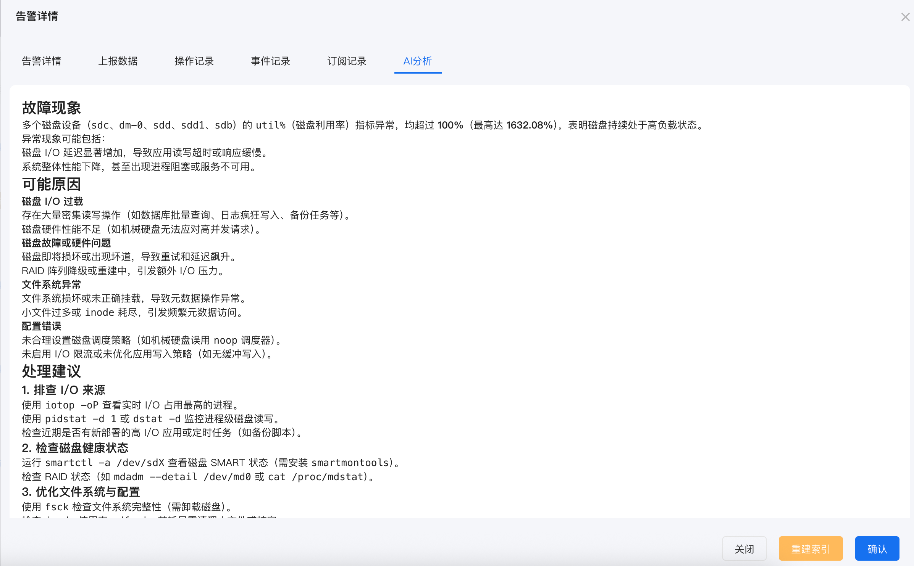

中文 / [English](README.en.md)

---

## 关于

neatlogic-alert是告警中心模块，主要用于收集来自不同来源的告警集中处理和展示。
neatlogic-alert不能单独部署，也不能单独构建，如需构建和部署，请参考[neatlogic-itom-all](../../../neatlogic-itom-all/blob/develop3.0.0/README.md)
的说明文档。

## 架构图

## 主要功能

### 告警类型管理

配置告警类型和adaptor

- 一个告警类型支持多个adaptor
- adaptor需要实现[neatlogic-alert-plugin-base](https://gitee.com/neat-logic/neatlogic-alert-plugin-base.git)接口

### 告警事件管理

- 目前支持的事件有：告警接入（起点事件）、创建告警、收敛告警、子告警加入、子告警移除、更新告警状态、关闭告警、打开告警、删除告警，将来根据需要可能会增加新的事件。
- 目前支持的插件有：创建告警、分配处理人、条件判断、定时调度、邮件通知、集成调用等，将来根据需要可能会增加新的事件插件，同时支持在自定义项目中实现个性化事件插件。

### 扩展属性管理

- 支持数字、文本、枚举和时间日期四种格式
- 枚举类型能自动保存数据作为搜索条件使用

### 告警视图

告警视图用于根据不同角色配置可查看的告警列表。

- 支持配置条件过滤告警数据
- 支持定义可视字段
- 支持授权限制使用范围

### 事件驱动式生命周期管理

通过事件驱动和纠缠实现复杂的生命周期管理。

- 支持10种事件，框架具备强大的事件扩充能力
- 提供15多个事件插件，支持告警状态修改、升级、分派、延时执行、条件判断、打标、关闭等场景，框架具备强大的插件扩充能力。

### 告警拓扑（商业版）

通过拓扑图方式展示告警

- 支持多种拓扑图元
- 支持绑定多种告警数据到图元

### 接入大模型（商业版）

通过大模型解析告警内容

- 支持openai和ollama两种接口

## 功能列表

<table>
    <tr>
        <td>编号</td>
        <td>分类</td>
        <td>功能点</td>
        <td>说明</td>
        <td>开源</td>
    </tr>
<tr>
    <td>1</td>
    <td>数据接入</td>
    <td>多数据源接入</td>
    <td>支持从消息队列、HTTP接口、文件、监控系统等多种数据源接入告警数据，统一汇聚处理。</td>
    <td>✅</td>
</tr>
<tr>
    <td>2</td>
    <td></td>
    <td>自定义适配器</td>
    <td>支持自定义适配器，把不同格式、不同字段结构的告警转换成统一格式，降低接入复杂度。</td>
    <td>✅</td>
</tr>
<tr>
    <td>3</td>
    <td></td>
    <td>适配器热加载</td>
    <td>适配器支持热更新和动态加载，不需要重启系统即可扩展新的告警源类型。</td>
    <td>✅</td>
</tr>
<tr>
    <td>4</td>
    <td>处理流程</td>
    <td>事件模型驱动</td>
    <td>通过事件模型管理告警生命周期，告警增删改均产生事件，驱动状态变化和处理动作。</td>
    <td>✅</td>
</tr>
<tr>
    <td>5</td>
    <td></td>
    <td>事件插件机制</td>
    <td>内置10多个事件插件，可以实现升级、指派、标记、修改字段、调用第三方接口等复杂业务。</td>
    <td>✅</td>
</tr>
<tr>
    <td>6</td>
    <td></td>
    <td>支持自定义事件插件</td>
    <td>开发者可提供新的事件插件扩展处理逻辑，满足特殊业务场景。</td>
    <td>✅</td>
</tr>
<tr>
    <td>7</td>
    <td>自定义能力</td>
    <td>自定义状态</td>
    <td>支持定义告警状态流程，例如 新建→处理→已解决→关闭，可根据业务要求自由配置。</td>
    <td>✅</td>
</tr>
<tr>
    <td>8</td>
    <td></td>
    <td>自定义级别</td>
    <td>支持定义告警严重级别，级别数量、文字、颜色均可配置，用于展示和过滤。</td>
    <td>✅</td>
</tr>
<tr>
    <td>9</td>
    <td></td>
    <td>自定义扩展字段</td>
    <td>可为告警添加扩展字段，类型包括文本、数字、列表、时间等，用于记录特定业务属性。</td>
    <td>✅</td>
</tr>
<tr>
    <td>10</td>
    <td></td>
    <td>字段动态显示与排序</td>
    <td>所有列表和详情页支持字段隐藏、排序、必填和校验规则的配置。</td>
    <td>✅</td>
</tr>
<tr>
    <td>11</td>
    <td>策略管理</td>
    <td>订阅策略</td>
    <td>按人、组织、系统设置告警订阅范围，包括级别、来源、对象、关键字等条件。</td>
    <td>❌</td>
</tr>
<tr>
    <td>12</td>
    <td></td>
    <td>屏蔽策略</td>
    <td>支持设置时间段、来源、级别、正则等屏蔽规则，降低告警噪声。</td>
    <td>❌</td>
</tr>
<tr>
    <td>13</td>
    <td>AI分析</td>
    <td>告警智能分析</td>
    <td>商业版支持接入AI大模型，对告警进行分类、模式识别、根因分析，提供处理建议。</td>
    <td>❌</td>
</tr>
<tr>
    <td>14</td>
    <td>集成能力</td>
    <td>开放接口</td>
    <td>提供完整API用于接入、查询、处理、统计，可与CMDB、自动化平台、监控系统联动。</td>
    <td>✅</td>
</tr>
</table>

